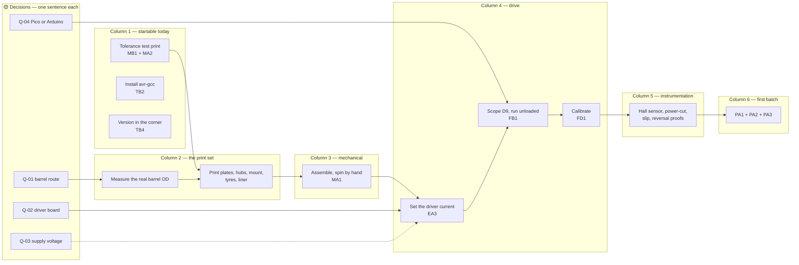

# Rock tumbler — Critical Path

**What can start now, and what waits for what.** Left to right: everything in a
column can be worked in parallel; nothing can start until its dependencies to
the left are done.

> **This document is checked, not merely derived.** `check_status.py` asserts
> that anything marked ✅ here is ✅ in `features_and_functions.md`.

*Updated 2026-09-22. Redistributed from the archived `WHATS_NEXT.md` (see
[`docket-archive/MANIFEST.md`](docket-archive/MANIFEST.md)); its phases 0–4
are columns 1–6 here. The cheap checks come before the expensive
commitments.*

---

## The chart

---

## Decisions — answer before or alongside column 1

| Code | Question | Unblocks |
|---|---|---|
| ⬜ **Q-01** | Which barrel? | The liner print and the barrel OD measurement (column 2) |
| ⬜ **Q-02** | Which driver board? | The current-setting procedure (column 4) |
| ⬜ **Q-03** | 12 V or 24 V? | Nothing in the design; the supply to buy or use |
| ⬜ **Q-04** | Pico or Arduino? | What gets wired and flashed (column 4) |

Each carries a working assumption in [`open_questions.md`](open_questions.md),
so none of them stops column 1.

## Column 1 — startable today

| Code | Task | Effort | Why now |
|---|---|---|---|
| ⬜ **MB1** · **MA2** | **Tolerance test print.** One `end_plate` and one `roller_hub` in PETG/ASA. Check the 608 bearing is a firm press fit (adjust `BRG_POCKET_FIT`, 0.15 mm now), the 8 mm rod slides through the hub with slight resistance (adjust the `ROD_D + 0.25` clearance), and measure the printed hub OD against `HUB_OD` to learn the printer's real offset | ~1 hour | **Do not skip.** Every clearance in the CAD is nominal. Every other part inherits these two fits, and getting them wrong wastes the whole print set |
| ⬜ **TB2** | Install the AVR toolchain: `brew tap osx-cross/avr && brew install avr-gcc` | 5 min | The only check in the sweep that cannot run on this Mac |
| ⬜ **TB4** | Show the project version in the upper-right of every interface, from `VERSION` | ~1 hour | The owner's standing rule for all projects; nothing displays it yet |
| ⬜ **TB5** | Gate the CAD-against-calculator geometry agreement | ~30 min | Turns **LE-07** from a check by eye into a check |

## Column 2 — the print set

*Needs the test print and **Q-01**.*

| Code | Task | Effort |
|---|---|---|
| ⬜ **MA1** | **Measure the real barrel's outside diameter** with calipers and set `BARREL_OD_MM` in `cad/tumbler.scad`, `firmware/main.py` and `firmware/arduino/tumbler_uno/tumbler_uno.ino`. The cradle spacing and the step rate both depend on it. Then run `tools/render.sh` at the real dimensions | 20 min |
| ⬜ **MB1** · **MB2** · **MA2** · **MA3** · **BB2** | Print the set: 2 × end plate, 2 × roller hub, 1 × motor mount in PETG/ASA (4 perimeters, 30% infill); 2 × tyre and 1 × liner in TPU 95A. For route A, set `RUBBER_T` to the **measured** sheet thickness and re-render first | a day of printing |

## Column 3 — mechanical

| Code | Task |
|---|---|
| ⬜ **MA1** | Assemble on a plywood or 2020 base (**MB3**) and **spin the barrel by hand**. It should roll freely, stay centred and not climb. This is where the 40° contact angle works or doesn't. If it walks, raise `FLANGE_H` before motorising |

## Column 4 — drive

*Needs **Q-02** and **Q-04**.*

| Code | Task |
|---|---|
| ⬜ **EA3** | **Set the driver current before connecting the motor.** Read the board's own sense resistors; start at 0.6 A (**KE**) |
| ⬜ **FB1** | Wire with a **common ground** between controller and driver. Measure the step rate on D9 with a scope or frequency counter: expect ~8,989 Hz. This is the one hardware claim in the project never measured. Then run unloaded and confirm the soft start holds traction |
| ⬜ **FD1** | Calibrate: count barrel revolutions against a stopwatch for 10 minutes and trim until commanded and measured agree. Then run loaded, winding the current down to the failure point and adding 30% back |

## Column 5 — instrumentation

This is the part that makes it worth building rather than buying.

| Code | Task |
|---|---|
| ⬜ **EB1** | Fit the magnet and hall sensor; confirm **exactly one pulse per revolution**. A miscount corrupts the dose silently |
| ⬜ **FB2** | **Pull the plug mid-run**, power back up, and confirm it resumes at the right count |
| ⬜ **FC3** | **Induce slip** with a little water or soap on a tyre; confirm the percentage climbs and the fault trips |
| ⬜ **FC2** | Confirm reversal fires on schedule and restarts cleanly |
| ⬜ **MB2** | Run 24 hours unattended. **Feel the motor and the printed mount**: if the mount is soft, the current is still too high |

## Column 6 — first batch

| Code | Task |
|---|---|
| ⬜ **PA1** · **PA2** · **PA3** | Source a four-stage grit kit and ceramic media, load per the rules, run stage 1 to 600,000 revolutions (~7 days at 60 rpm), **wash everything** between stages, and record revolutions and finish |

---

## Risks worth watching

| Risk | Signal | Mitigation |
|---|---|---|
| Bearing pocket wrong for this printer | Bearing loose or won't seat | Column 1 test print |
| Barrel walks off the rollers | Drifts along the rollers on the hand test | Taller flanges before motorising |
| Drip tray won't fit (**MB4**) | Only **20 mm** under the barrel | Raise `FOOT_W`, or a shallow tray |
| Grit seizes the cleanout threads | Plug stiffens each time | Clean the threads every opening, or a compression lid (**BC1**) |
| Printed mount softens | Motor mount warm or deformed | Lower the current; ASA over PETG |
| Hall sensor miscounts | Dose advances at the wrong rate | Verify pulses per revolution in column 5 |
| Step rate wrong | Barrel speed differs from the calculation | Scope D9 in column 4 |

---

## Reading the chart

- **A column is a to-do list**, not a sprint.
- **A decision node is the cheapest thing on the chart.** Answering a question
  is usually higher leverage than any work.
- **Dotted lines** are consequences rather than blockers.
